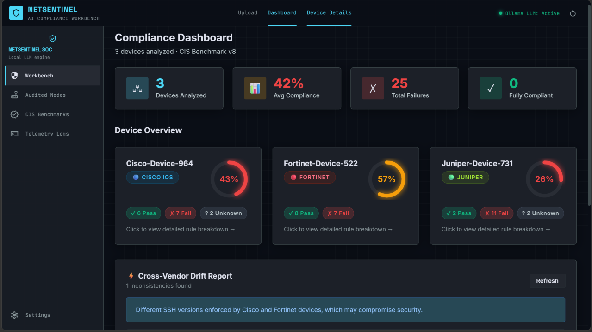
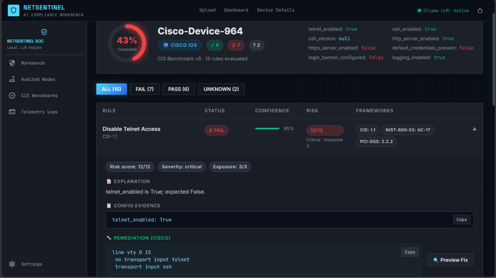
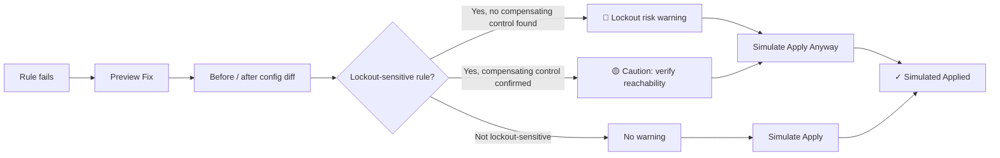
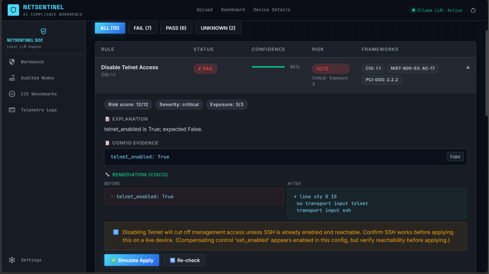
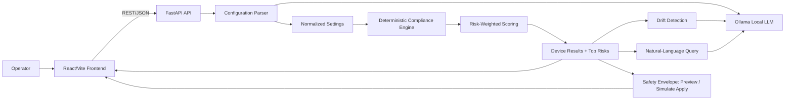
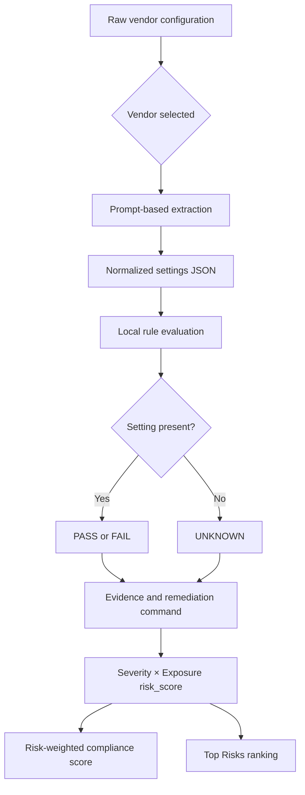
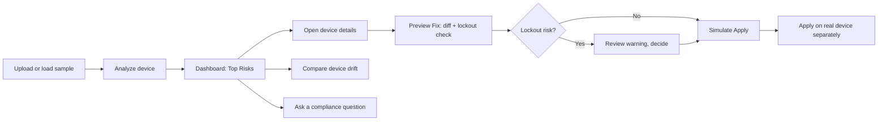

# NetSentinel

NetSentinel is an AI-assisted network configuration compliance analyzer for Cisco IOS, Fortinet FortiOS, and Juniper JunOS. It accepts raw device configuration text, normalizes vendor-specific settings, evaluates security controls with **risk-weighted prioritization**, highlights cross-device drift, and gives operators a **safety-checked remediation workflow** instead of a bare fix command.

The project is designed as a working prototype: the frontend is React/Vite, the API is FastAPI, and the local language model runs through Ollama. No cloud LLM API key is required for the default setup.


*The dashboard surfaces the highest-priority failures across your entire fleet first, ranked by severity × exposure — not just a flat pass/fail percentage.*

## Why NetSentinel

Most configuration-compliance tools stop at "here's a list of failed checks and a command to fix them." That leaves two real problems unsolved:

1. **Which failure do I fix first?** A flat pass/fail count treats a missing login banner the same as an open Telnet port on an internet-facing router. That's wrong, and it wastes an operator's time triaging manually.
2. **Is it safe to apply this fix?** The single biggest reason operators don't remediate known issues is fear of locking themselves out of the device. A tool that hands over a fix command with no safety check is asking for an outage.

NetSentinel addresses both directly, and both are demonstrated in this prototype end-to-end:

### 1. Risk-weighted compliance scoring

Every rule failure is scored by **severity × exposure**, not counted equally. A `critical` severity, internet-facing failure (e.g. Telnet enabled with no ACL) drags the compliance score down far more than a `low` severity, internal-only issue (e.g. missing NTP config) — matching how a real security review would actually prioritize.

```json
{
  "compliance_score": 55.8,
  "top_risks": [
    { "rule_id": "CIS-1.1", "rule_name": "Disable Telnet", "severity": "critical", "risk_score": 12 },
    { "rule_id": "CIS-1.13", "rule_name": "Configure Management ACL", "severity": "critical", "risk_score": 12 },
    { "rule_id": "CIS-1.6", "rule_name": "Disable Default SNMP Community", "severity": "high", "risk_score": 8 }
  ]
}
```

Each of the 15 CIS-oriented rules also carries mappings to **NIST 800-53** and **PCI-DSS** control IDs, so one scan produces audit evidence for multiple compliance frameworks simultaneously — not just CIS.


*Per-rule severity, exposure weight, risk score, and multi-framework mapping (CIS / NIST / PCI-DSS).*

### 2. Safety-envelope remediation (dry-run → lockout check → simulated apply)

Instead of just printing a fix command, NetSentinel walks the operator through a review workflow before anything is treated as applied:



The lockout check is **context-aware**, not a static warning on every fix. For example, disabling Telnet (`CIS-1.1`) only raises a hard warning if SSH isn't already confirmed enabled in that device's config; a Management ACL change (`CIS-1.13`) is always flagged, since there's no reliable compensating control to check for. `Simulate Apply` is deliberately gated behind `Preview Fix` at the API level — you cannot apply a change you haven't reviewed.


*A Management ACL fix flagged as lockout-risk, with the before/after diff shown before any action is taken.*

This is a prototype-level safety model, not a production auto-remediation system — no real device connection exists yet (see [Known Limitations](#known-limitations)). The point being demonstrated is the *workflow*: prioritize by real risk, preview before applying, and flag the specific ways a fix could break access — rather than a flat list of commands with no guardrails.

## What Problem It Solves

Network teams often review configuration files that differ significantly by vendor and syntax. Traditional compliance tools usually depend on a parser for every platform, expose results as opaque pass/fail checks, and hand back fix commands with no indication of priority or risk.

NetSentinel focuses on a more flexible and safer workflow:

1. Upload one or more raw configuration files.
2. Identify the vendor and device.
3. Extract normalized security settings from the configuration.
4. Evaluate those settings against CIS-inspired controls, weighted by severity and exposure.
5. Explain failures, rank them by risk, and show vendor-specific remediation commands.
6. Preview each fix as a diff and flag lockout risk before it's considered "applied."
7. Compare analyzed devices for inconsistent security policy.
8. Ask natural-language questions about the results.

## Core Capabilities

- Cisco IOS, Fortinet FortiOS, and Juniper JunOS sample workflows.
- Paste, drag and drop, or upload `.txt`, `.cfg`, `.conf`, and `.log` files.
- Local Ollama model integration through a small provider wrapper.
- Normalized settings for SSH, Telnet, HTTP management, logging, NTP, SNMP, AAA, password encryption, management ACLs, and session timeouts.
- Fifteen CIS-oriented rules stored as data in `backend/rules/cis_benchmarks.json`, each mapped to CIS, NIST 800-53, and/or PCI-DSS control IDs.
- **Risk-weighted compliance score** (severity × exposure), not a flat pass/fail percentage.
- **Top Risks** ranking — per-device and aggregated across the whole fleet — surfacing what to fix first.
- **Safety-envelope remediation**: dry-run diff preview, context-aware lockout-risk detection, and a gated simulate-apply workflow.
- Cross-vendor drift detection.
- Natural-language queries over analyzed results.
- In-memory storage suitable for demos and prototypes.

## System Blueprint



### Request lifecycle

```text
Raw config
   |
   v
POST /api/upload
   |
   v
Device record in the in-memory store
   |
   v
POST /api/analyze/{device_id}
   |
   +--> Ollama extracts normalized settings
   |
   +--> Python evaluates the CIS rules locally
   |
   +--> Risk-weighted score + top_risks computed
   |
   +--> DeviceResult is stored and returned
   |
   v
Dashboard (Top Risks), device detail, drift report, natural-language queries
   |
   v
POST /api/simulate-fix/{device_id}/{rule_id}   (dry-run diff + lockout check)
   |
   v
POST /api/simulate-apply/{device_id}/{rule_id}  (gated on a prior preview)
```

### Analysis pipeline



This pipeline deliberately separates language understanding from compliance scoring. Ollama interprets vendor syntax once; Python then evaluates the structured values against the JSON rule set and computes risk weighting entirely locally. That makes the score faster, reproducible, and easier to audit — and means a bad LLM extraction on one field can't silently change how failures are prioritized.

### Operator workflow



## Repository Structure

```text
prototype1/
├── README.md
├── .gitignore
├── .vscode/
│   └── settings.json              VS Code interpreter selection
├── backend/
│   ├── main.py                    FastAPI routes, in-memory stores, safety-envelope endpoints
│   ├── requirements.txt            Python dependencies
│   ├── llm/
│   │   ├── gemini_client.py        Ollama HTTP client; legacy filename
│   │   ├── config_parser.py        Raw config to normalized settings
│   │   ├── compliance_engine.py    Rule evaluation, risk scoring, lockout assessment, drift prompts
│   │   └── nl_query.py              Natural-language result queries
│   ├── models/
│   │   └── schemas.py              Pydantic request and response models, incl. FixPreview
│   ├── rules/
│   │   └── cis_benchmarks.json     Fifteen compliance controls with severity/exposure/framework mapping
│   └── sample_configs/
│       ├── cisco_ios.txt
│       ├── fortios.txt
│       └── junos.txt
└── frontend/
    ├── package.json                Vite scripts and JavaScript dependencies
    ├── index.html
    └── src/
        ├── App.jsx                 Routes and application shell
        ├── api/client.js            Axios API client, incl. simulate-fix/apply/fix-state
        ├── pages/
        │   ├── Upload.jsx           Upload and analyze workflow
        │   ├── Dashboard.jsx        Scores, Top Risks panel, drift, and queries
        │   └── DeviceDetail.jsx     Rule-by-rule findings, Preview Fix / Simulate Apply UI
        └── index.css                Application styling
```

## Technology Choices

| Layer | Technology | Responsibility |
|---|---|---|
| UI | React with Vite | Upload workflow, dashboard, and detail views |
| API | FastAPI | Validation, analysis orchestration, and REST endpoints |
| Data validation | Pydantic | Typed request and response contracts |
| Local model | Ollama with `llama3.2:1b` | Config extraction and natural-language answers |
| Compliance logic | Python and JSON rules | Fast, repeatable rule evaluation and risk-weighted scoring |
| Safety envelope | Python (in-memory state machine) | Dry-run preview, lockout assessment, gated simulate-apply |
| HTTP client | Axios and Python standard library | Frontend API calls and Ollama transport |

## Local Setup

### Prerequisites

- Windows, macOS, or Linux
- Python 3.10 or newer
- Node.js and npm
- Ollama
- Enough disk space for the local model

### 1. Install Python dependencies

From the repository root:

```bash
python -m venv .venv
.venv/bin/python -m pip install -r backend/requirements.txt
```

On Windows, use the equivalent interpreter inside `.venv/Scripts/` if your shell does not resolve `.venv/bin/python`.

### 2. Install and prepare Ollama

Install Ollama from [ollama.com](https://ollama.com), then download the model:

```bash
ollama pull llama3.2:1b
```

Ollama normally runs as a Windows background application. If it is not running, start its server:

```bash
ollama serve
```

Optional backend settings can be placed in `backend/.env`:

```env
OLLAMA_MODEL=llama3.2:1b
OLLAMA_URL=<ollama-endpoint>/api/generate
```

Never commit `backend/.env`. It is ignored by `.gitignore`.

### 3. Start the backend

Open a terminal and run:

```bash
cd backend
../.venv/bin/python -m uvicorn main:app --reload --port 8000
```

Example service addresses:

- API: `http://<api-host>:8000`
- Swagger documentation: `http://<api-host>:8000/docs`

### 4. Start the frontend

Open a second terminal:

```bash
cd frontend
npm install
npm run dev
```

Open the application at an address like `http://<frontend-host>:5173`.

## Sample Test Walkthrough

1. Open the frontend address shown by the Vite development server, for example `http://<frontend-host>:5173`.
2. Open the Upload page.
3. Select `Cisco IOS` and click **Load Sample**.
4. Click **Add Another Device**.
5. Select `Fortinet FortiOS` and click **Load Sample**.
6. Add a third device, select `Juniper JunOS`, and click **Load Sample**.
7. Click **Analyze All Devices**.
8. Review the dashboard's **Top Risks Across Your Network** panel and per-device compliance scores.
9. Open a device card for detailed findings.
10. Expand a `FAIL` rule and click **Preview Fix** to see the before/after diff and any lockout warning.
11. Click **Simulate Apply** (or **Simulate Apply Anyway** for lockout-flagged rules) to confirm the workflow.
12. Run drift analysis after at least two devices are analyzed.
13. Try a question such as `Which devices allow Telnet?`.

The sample files are versioned in `backend/sample_configs/`. You can also upload your own text configuration using the Upload File button. Do not upload private keys, live passwords, or sensitive production credentials.

## API Blueprint

| Method | Endpoint | Purpose |
|---|---|---|
| `GET` | `/` | API health message |
| `GET` | `/api/samples/{vendor}` | Load a bundled sample config |
| `POST` | `/api/upload` | Register a device config |
| `POST` | `/api/analyze/{device_id}` | Extract settings, evaluate rules, compute risk-weighted score |
| `POST` | `/api/analyze-all` | Analyze every uploaded device |
| `GET` | `/api/results` | Return all analyzed results |
| `GET` | `/api/results/{device_id}` | Return one device result |
| `POST` | `/api/simulate-fix/{device_id}/{rule_id}` | Dry-run diff preview + lockout-risk assessment for one rule |
| `POST` | `/api/simulate-apply/{device_id}/{rule_id}` | Mark a fix as simulated-applied (requires a prior preview) |
| `GET` | `/api/fix-state/{device_id}` | Current preview/apply state for every rule on a device |
| `GET` | `/api/drift` | Compare settings across analyzed devices |
| `POST` | `/api/query` | Ask a natural-language question |
| `DELETE` | `/api/reset` | Clear the in-memory demo state |

### Upload request example

```json
{
  "vendor": "cisco",
  "device_name": "branch-router-01",
  "config_text": "hostname branch-router-01\nip ssh version 2"
}
```

### Analysis result shape

```text
DeviceResult
├── device_id
├── device_name
├── vendor
├── compliance_score        (risk-weighted, not a flat percentage)
├── extracted_settings
├── top_risks[]             (top 3 FAIL/UNKNOWN rules, sorted by risk_score desc)
│   ├── rule_id
│   ├── rule_name
│   ├── severity
│   ├── risk_score
│   └── fix_command
└── rule_results[]
    ├── rule_id
    ├── rule_name
    ├── status: PASS | FAIL | UNKNOWN
    ├── confidence
    ├── explanation
    ├── config_snippet
    ├── fix_command
    ├── severity: critical | high | medium | low
    ├── exposure_weight: 1-3
    ├── risk_score          (severity_weight × exposure_weight)
    └── frameworks[]        (CIS, NIST-800-53, PCI-DSS control mappings)
```

### Simulate-fix response shape

```text
FixPreview
├── rule_id
├── rule_name
├── before                  (current config value/snippet)
├── after                   (proposed fix command)
├── severity
├── risk_score
├── lockout_risk            (true/false — context-aware, not static per rule)
├── lockout_warning         (explanation, or a softened caution if a compensating control was found)
└── state: dry_run_reviewed | simulated_applied
```

## Why It Differs From Existing Solutions

NetSentinel is not intended to replace enterprise configuration management, SIEM, or a full policy-as-code platform. Its difference is the combination of flexible understanding, risk-aware prioritization, and a safety-checked remediation workflow in a small prototype.

| Dimension | Traditional parser-based tools | NetSentinel prototype |
|---|---|---|
| Vendor onboarding | Requires a parser and maintenance for each syntax | Uses normalized extraction prompts and vendor context |
| Input quality | Often expects a strict known format | Handles raw, partial, and mixed configuration text better |
| Findings | Usually a control ID and status | Adds explanation, evidence snippet, confidence, severity, and fix command |
| **Prioritization** | **Flat pass/fail count or percentage** | **Risk-weighted score (severity × exposure); ranked Top Risks per device and fleet-wide** |
| **Remediation safety** | **Fix command with no context on risk of applying it** | **Dry-run diff + context-aware lockout-risk detection before a fix is "applied"** |
| Cross-vendor policy | Often separated by product or parser | Places normalized settings into one comparison model |
| Compliance framework coverage | Usually one framework per tool/report | One scan maps to CIS, NIST 800-53, and PCI-DSS simultaneously |
| Investigation | Fixed filters and reports | Natural-language questions over analyzed results |
| Deployment | Commonly cloud or enterprise infrastructure | Runs locally with Ollama and a FastAPI service |
| Rule execution | May send every check through a remote service | Extracts once, then evaluates the 15 controls locally and deterministically |
| Prototype iteration | Changes can require parser releases | Rules live in JSON and can be edited independently |

### The important design distinction

The LLM is used only where language understanding is valuable: converting vendor syntax into normalized settings and answering natural-language questions. The compliance score, risk weighting, Top Risks ranking, and lockout assessment are all calculated **locally and deterministically** from structured settings and JSON rules — no LLM call is in the critical path for scoring or safety decisions. This separation makes results faster, easier to audit, and means a hallucinated or inconsistent LLM response can't silently change a risk score or bypass a lockout warning.

## Security and Operational Notes

- The default data store is in memory; restarting FastAPI clears uploaded devices, results, and fix-preview/apply state.
- The Ollama model runs locally, so configuration text does not need to leave the machine.
- Treat uploaded configuration files as sensitive operational data.
- Do not commit `.env`, credentials, private keys, or real production configurations.
- **No real device is ever touched.** `Simulate Apply` only updates in-memory demo state — operators must review and execute remediation on the actual device separately. See [Known Limitations](#known-limitations).
- LLM extraction can be wrong or incomplete. Use the evidence snippet and verify findings against the original configuration before making changes.
- Lockout-risk detection is a curated, prototype-level heuristic for 5 specific rules (Telnet, SSH version, HTTP server, AAA, management ACL) — it is not exhaustive and should not be treated as a guarantee against lockout on a real device.

## Known Limitations

- The current rule set is a curated prototype, not a complete CIS implementation.
- Vendor detection is selected by the user rather than inferred automatically.
- The local model can be slow on CPU, especially with larger configurations.
- Natural-language drift analysis still uses the local model and may take longer than deterministic scoring.
- Results, risk previews, and fix-apply state are not persisted in a database — they reset on backend restart.
- The API has permissive CORS settings for local demos and should be restricted before deployment.
- `Simulate Apply` does not connect to or modify a real device; it only demonstrates the review-before-apply workflow.
- Lockout-risk assessment covers 5 curated rules and does not verify actual reachability of a compensating control — only whether it appears enabled in the parsed config.

## Future Roadmap

1. Add SQLite or PostgreSQL persistence for results and fix-state history.
2. Connect `Simulate Apply` to a real device session (SSH-based), with a canary/staged rollout before fleet-wide apply.
3. Add background jobs and progress events for long-running analyses.
4. Add automatic vendor detection and configuration redaction.
5. Expand CIS coverage, lockout-sensitive rule coverage, and support custom organization rules.
6. Add regression fixtures for each supported vendor.
7. Add authentication, restricted CORS, audit logs, and role-based access.
8. Add export to JSON, CSV, and PDF, including risk-ranked audit reports per framework (CIS/NIST/PCI-DSS).
9. Add topology-aware drift detection (segment-level policy consistency, not just pairwise).
10. Add optional integrations for Git repositories, ticketing systems, and device inventory.

## License

This repository is a prototype for network compliance analysis. Add a project-specific license before distributing it as a product.
