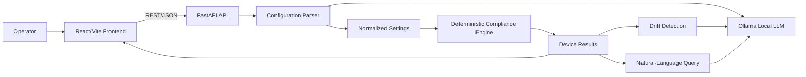
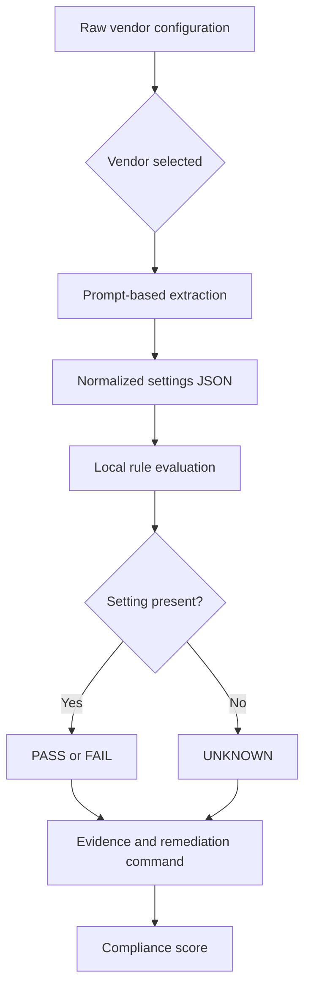
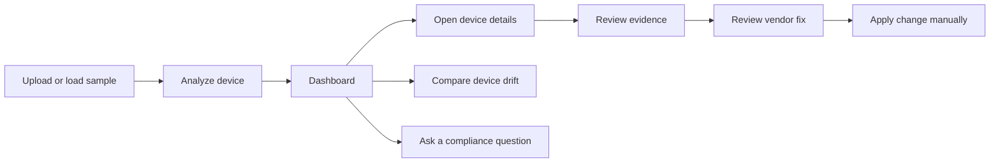

# NetSentinel

NetSentinel is an AI-assisted network configuration compliance analyzer for Cisco IOS, Fortinet FortiOS, and Juniper JunOS. It accepts raw device configuration text, normalizes vendor-specific settings, evaluates security controls, highlights cross-device drift, and gives operators a practical dashboard for remediation.

The project is designed as a working prototype: the frontend is React/Vite, the API is FastAPI, and the local language model runs through Ollama. No cloud LLM API key is required for the default setup.

## What Problem It Solves

Network teams often review configuration files that differ significantly by vendor and syntax. Traditional compliance tools usually depend on a parser for every platform and expose results as opaque pass/fail checks.

NetSentinel focuses on a more flexible workflow:

1. Upload one or more raw configuration files.
2. Identify the vendor and device.
3. Extract normalized security settings from the configuration.
4. Evaluate those settings against CIS-inspired controls.
5. Explain failures and show vendor-specific remediation commands.
6. Compare analyzed devices for inconsistent security policy.
7. Ask natural-language questions about the results.

## Core Capabilities

- Cisco IOS, Fortinet FortiOS, and Juniper JunOS sample workflows.
- Paste, drag and drop, or upload `.txt`, `.cfg`, `.conf`, and `.log` files.
- Local Ollama model integration through a small provider wrapper.
- Normalized settings for SSH, Telnet, HTTP management, logging, NTP, SNMP, AAA, password encryption, management ACLs, and session timeouts.
- Fifteen CIS-oriented rules stored as data in `backend/rules/cis_benchmarks.json`.
- Compliance score, rule status, confidence, explanation, config snippet, and fix command.
- Cross-vendor drift detection.
- Natural-language queries over analyzed results.
- In-memory storage suitable for demos and prototypes.

## System Blueprint



### Request lifecycle

```text
Raw config
   |
   v
POST /api/upload
   |
   v
Device record in the in-memory store
   |
   v
POST /api/analyze/{device_id}
   |
   +--> Ollama extracts normalized settings
   |
   +--> Python evaluates the CIS rules locally
   |
   +--> DeviceResult is stored and returned
   |
   v
Dashboard, device detail, drift report, and natural-language queries
```

### Analysis pipeline



This pipeline deliberately separates language understanding from compliance scoring. Ollama interprets vendor syntax once; Python then evaluates the structured values against the JSON rule set. That makes the score faster, reproducible, and easier to audit.

### Operator workflow



## Repository Structure

```text
prototype1/
├── README.md
├── .gitignore
├── .vscode/
│   └── settings.json              VS Code interpreter selection
├── backend/
│   ├── main.py                    FastAPI routes and in-memory stores
│   ├── requirements.txt            Python dependencies
│   ├── check_syntax.py             Backend syntax helper
│   ├── llm/
│   │   ├── gemini_client.py        Ollama HTTP client; legacy filename
│   │   ├── config_parser.py        Raw config to normalized settings
│   │   ├── compliance_engine.py    Local rule evaluation and drift prompts
│   │   └── nl_query.py              Natural-language result queries
│   ├── models/
│   │   └── schemas.py              Pydantic request and response models
│   ├── rules/
│   │   └── cis_benchmarks.json     Fifteen compliance controls
│   └── sample_configs/
│       ├── cisco_ios.txt
│       ├── fortios.txt
│       └── junos.txt
└── frontend/
    ├── package.json                Vite scripts and JavaScript dependencies
    ├── index.html
    └── src/
        ├── App.jsx                 Routes and application shell
        ├── api/client.js            Axios API client
        ├── pages/
        │   ├── Upload.jsx           Upload and analyze workflow
        │   ├── Dashboard.jsx        Scores, drift, and queries
        │   └── DeviceDetail.jsx     Rule-by-rule findings
        └── style.css                Application styling
```

## Technology Choices

| Layer | Technology | Responsibility |
|---|---|---|
| UI | React with Vite | Upload workflow, dashboard, and detail views |
| API | FastAPI | Validation, analysis orchestration, and REST endpoints |
| Data validation | Pydantic | Typed request and response contracts |
| Local model | Ollama with `llama3.2:1b` | Config extraction and natural-language answers |
| Compliance logic | Python and JSON rules | Fast, repeatable rule evaluation |
| HTTP client | Axios and Python standard library | Frontend API calls and Ollama transport |

## Local Setup

### Prerequisites

- Windows, macOS, or Linux
- Python 3.10 or newer
- Node.js and npm
- Ollama
- Enough disk space for the local model

### 1. Install Python dependencies

From the repository root:

```bash
python -m venv .venv
.venv/bin/python -m pip install -r backend/requirements.txt
```

On Windows, use the equivalent interpreter inside `.venv/Scripts/` if your shell does not resolve `.venv/bin/python`.

### 2. Install and prepare Ollama

Install Ollama from [ollama.com](https://ollama.com), then download the model:

```bash
ollama pull llama3.2:1b
```

Ollama normally runs as a Windows background application. If it is not running, start its server:

```bash
ollama serve
```

Optional backend settings can be placed in `backend/.env`:

```env
OLLAMA_MODEL=llama3.2:1b
OLLAMA_URL=<ollama-endpoint>/api/generate
```

Never commit `backend/.env`. It is ignored by `.gitignore`.

### 3. Start the backend

Open a terminal and run:

```bash
cd backend
../.venv/bin/python -m uvicorn main:app --reload --port 8000
```

Example service addresses:

- API: `http://<api-host>:8000`
- Swagger documentation: `http://<api-host>:8000/docs`

### 4. Start the frontend

Open a second terminal:

```bash
cd frontend
npm install
npm run dev
```

Open the application at an address like `http://<frontend-host>:5173`.

## Sample Test Walkthrough

1. Open the frontend address shown by the Vite development server, for example `http://<frontend-host>:5173`.
2. Open the Upload page.
3. Select `Cisco IOS` and click **Load Sample**.
4. Click **Add Another Device**.
5. Select `Fortinet FortiOS` and click **Load Sample**.
6. Add a third device, select `Juniper JunOS`, and click **Load Sample**.
7. Click **Analyze All Devices**.
8. Review the dashboard scores and failed controls.
9. Open a device card for detailed findings.
10. Run drift analysis after at least two devices are analyzed.
11. Try a question such as `Which devices allow Telnet?`.

The sample files are versioned in `backend/sample_configs/`. You can also upload your own text configuration using the Upload File button. Do not upload private keys, live passwords, or sensitive production credentials.

## API Blueprint

| Method | Endpoint | Purpose |
|---|---|---|
| `GET` | `/` | API health message |
| `GET` | `/api/samples/{vendor}` | Load a bundled sample config |
| `POST` | `/api/upload` | Register a device config |
| `POST` | `/api/analyze/{device_id}` | Extract settings and analyze one device |
| `POST` | `/api/analyze-all` | Analyze every uploaded device |
| `GET` | `/api/results` | Return all analyzed results |
| `GET` | `/api/results/{device_id}` | Return one device result |
| `GET` | `/api/drift` | Compare settings across analyzed devices |
| `POST` | `/api/query` | Ask a natural-language question |
| `DELETE` | `/api/reset` | Clear the in-memory demo state |

### Upload request example

```json
{
  "vendor": "cisco",
  "device_name": "branch-router-01",
  "config_text": "hostname branch-router-01\nip ssh version 2"
}
```

### Analysis result shape

```text
DeviceResult
├── device_id
├── device_name
├── vendor
├── compliance_score
├── extracted_settings
└── rule_results[]
    ├── rule_id
    ├── rule_name
    ├── status: PASS | FAIL | UNKNOWN
    ├── confidence
    ├── explanation
    ├── config_snippet
    ├── fix_command
    └── frameworks[]
```

## Why It Differs From Existing Solutions

NetSentinel is not intended to replace enterprise configuration management, SIEM, or a full policy-as-code platform. Its difference is the combination of flexible understanding and operationally useful output in a small workflow.

| Dimension | Traditional parser-based tools | NetSentinel prototype |
|---|---|---|
| Vendor onboarding | Requires a parser and maintenance for each syntax | Uses normalized extraction prompts and vendor context |
| Input quality | Often expects a strict known format | Handles raw, partial, and mixed configuration text better |
| Findings | Usually a control ID and status | Adds explanation, evidence snippet, confidence, and fix command |
| Cross-vendor policy | Often separated by product or parser | Places normalized settings into one comparison model |
| Investigation | Fixed filters and reports | Natural-language questions over analyzed results |
| Deployment | Commonly cloud or enterprise infrastructure | Runs locally with Ollama and a FastAPI service |
| Rule execution | May send every check through a remote service | Extracts once, then evaluates the 15 controls locally and deterministically |
| Prototype iteration | Changes can require parser releases | Rules live in JSON and can be edited independently |

### The important design distinction

The LLM is used where language understanding is valuable: converting vendor syntax into normalized settings and answering questions. The compliance score is calculated locally from structured settings and JSON rules. This separation makes results faster, easier to inspect, and less dependent on repeated model calls.

## Security and Operational Notes

- The default data store is in memory; restarting FastAPI clears uploaded devices and results.
- The Ollama model runs locally, so configuration text does not need to leave the machine.
- Treat uploaded configuration files as sensitive operational data.
- Do not commit `.env`, credentials, private keys, or real production configurations.
- The prototype does not automatically apply fix commands to devices. Operators must review and execute remediation separately.
- LLM extraction can be wrong or incomplete. Use the evidence snippet and verify findings against the original configuration before making changes.

## Known Limitations

- The current rule set is a curated prototype, not a complete CIS implementation.
- Vendor detection is selected by the user rather than inferred automatically.
- The local model can be slow on CPU, especially with larger configurations.
- Natural-language drift analysis still uses the local model and may take longer than deterministic scoring.
- Results are not persisted in a database.
- The API has permissive CORS settings for local demos and should be restricted before deployment.

## Future Roadmap

1. Add SQLite or PostgreSQL persistence and user/project separation.
2. Add background jobs and progress events for long-running analyses.
3. Add automatic vendor detection and configuration redaction.
4. Expand CIS coverage and support custom organization rules.
5. Add regression fixtures for each supported vendor.
6. Add authentication, restricted CORS, audit logs, and role-based access.
7. Add export to JSON, CSV, and PDF.
8. Add optional integrations for Git repositories, ticketing systems, and device inventory.

## License

This repository is a prototype for network compliance analysis. Add a project-specific license before distributing it as a product.
